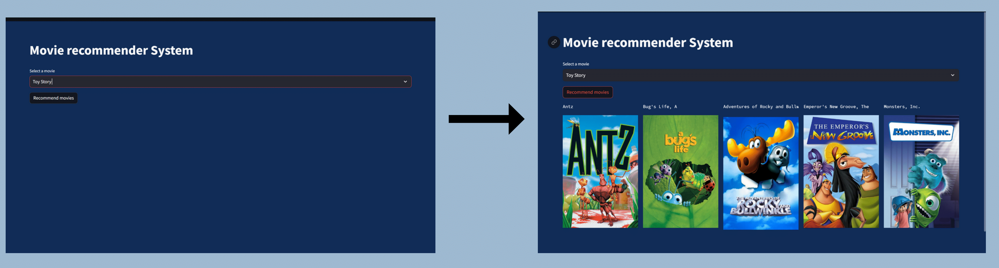

# Movie Recommender System

#### Abstract
With the vast amount of movies available across various platforms, users often face the challenge
of selecting movies that align with their individual preferences and interests.Sometimes the case is
like user watched some movie and liked that movie and he/she wants to watch some similar kind of
movie but does not specifically know the name of the movie in this case movie recommender system
can be helpful for them.For implementing this recommendation system we can make use of genre
and some comments given by user which are incorporated as tags in our dataset for recommending
movies.By encoding genres and user tags, the system can calculate similarity between movies and user preferences using metrics like cosine similarity. 

## Problem Statement:
In today's digital era, the sheer volume of available movies across various streaming platforms and media services can be overwhelming for individuals seeking new and engaging content. As a result, many users struggle to discover films that align with their unique tastes and preferences, leading to a suboptimal viewing experience.

A movie recommendation system addresses this challenge by providing users with personalized suggestions based on their individual profiles, search and browsing history, and the preferences of similar users. By analyzing vast datasets and user behavior, the system can deliver customized recommendations that enhance the user's enjoyment and satisfaction with their movie-watching experience.

The goal of the project is to design and implement an AI-based recommendation system that effectively curates a list of movies tailored to each user's interests and viewing habits. This system will improve content discovery and user engagement, ultimately leading to a more satisfying and efficient movie-watching experience.

#### Link to the dataset :
[Movie Lens Dataset](https://www.kaggle.com/datasets/shubhammehta21/movie-lens-small-latest-dataset).
#### Proposed Solution
By making use of the genres and tags given by user we can make our recommender system work.The approach which we took is by converting movies into vectors and then  by making use of the similarity matrix generatedwe can find movies with the highest cosine similarity scores to the target movie.
#### Link to the spotlight video:
[Link to the spotlight video presentaion](https://youtu.be/Q1VWzJcuj1Y).

#### Citations:
[Movie Recommender System by CampusX](https://www.youtube.com/watch?v=1xtrIEwY_zY&t=6256s)

[Movie Recommender System by Krish Naik](https://www.youtube.com/watch?v=A_78fGgQMjM)

[Content Based Movie Recommendation System](https://medium.com/web-mining-is688-spring-2021/content-based-movie-recommendation-system-72f122641eab)

[DBSCAN/wiki](https://en.wikipedia.org/wiki/DBSCAN).

[Agglomerative Methods in Machine Learning](https://www.geeksforgeeks.org/agglomerative-methods-in-machine-learning/)

### Contributors:
1. Sahil Sharma
2. Shruti Chaudhary 
3. Khyati Sisodia
4. Kandrathi Sai Aiswayrya
5. Kamal Kumar
6. Mohit Jingar
7. Yesha Shah

@InProceedings{
        PRML Project 2024,

        contributors    = {Sahil, Shruti and Aiswarya, Kamal and Mohit, Yesha and Khyati},
        
        title     = {Movie Recommendation System for recommending movies similar to the movie in query},
        
        year      = {2024}
    }
